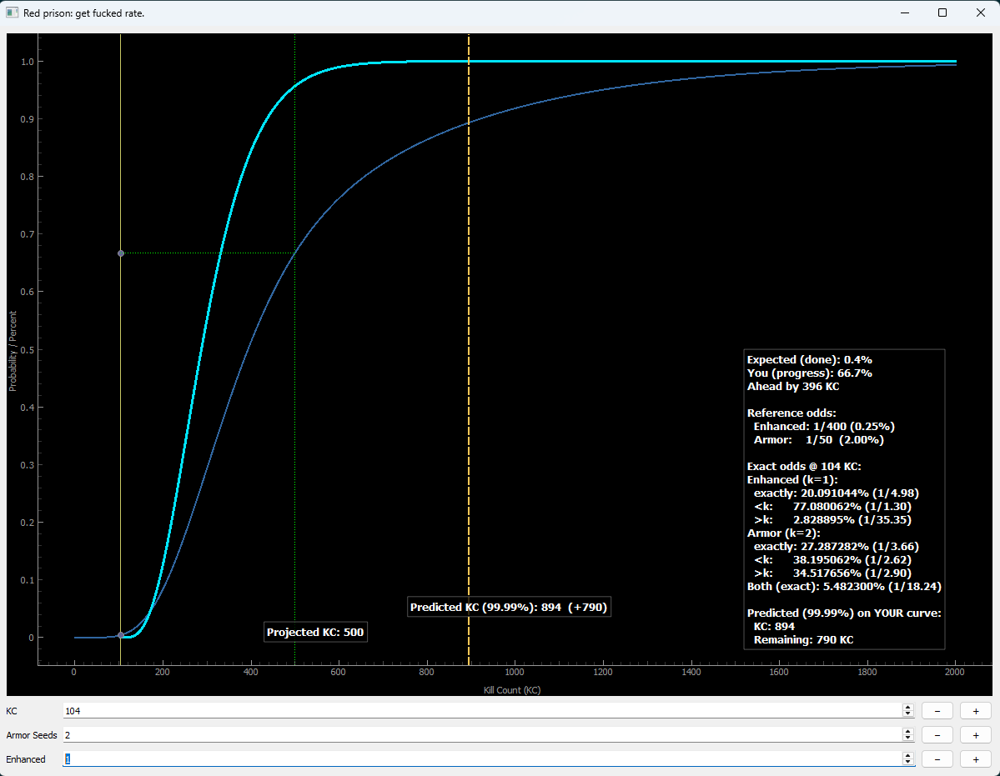

# OSRS DryCalc — Kill Count & Loot Probability Analyzer

A desktop application that models drop probability and visualizes player progress for the Corrupted Gauntlet encounter in Old School RuneScape.

## Overview of the App Idea

This application models the mathematics behind a specific Old School RuneScape encounter, in this case the **Corrupted Gauntlet**.

The goal of the tool is to track, using user input, how many kill counts (KC) a player has completed and whether they have received any of the seven target drops from this encounter (1 Enhanced Crystal Weapon Seed and 6 Crystal Armor Seeds).

The application also determines whether the player is statistically "ahead of the curve" when it comes to drop rates, meaning whether they are luckier or drier than expected.

A key feature of the tool is a real-time graph that allows the player to see where they are compared to the mathematical average or cumulative distribution.

---



## Concepts

This project consists of two main components, a mathematical component and a programming component.

The mathematical part focuses on probability modeling and statistical analysis, including geometric distributions and negative binomial distributions based on the Bernoulli process.

The programming component involves implementing these models in Python and constructing a graphical interface that allows interactive input and visualizes the results in real time.

The technology stack used consists of:

1. NumPy
2. PyQt5
3. pyqtgraph
4. PyInstaller

---

## The App

The application provides a graph that shows the Cumulative Distribution Function (CDF) for the completion of the encounter (Corrupted Gauntlet in this case) and another function that represents the player's progress based on their obtained drops.

The graph updates dynamically as the user inputs their current kill count and drop state, allowing them to visualize their statistical position relative to the expected distribution.

---

## Mathematical Model

The probability model assumes independent drop events with constant drop rates.

### Enhanced Crystal Weapon Seed

The enhanced seed is modeled using a **geometric distribution**, which represents the probability of obtaining the first success in a sequence of independent Bernoulli trials with a fixed probability.

Drop rate used:

- 1 / 400 per kill

### Crystal Armor Seeds

The armor seeds are modeled using a **negative binomial distribution**, representing the probability of achieving a fixed number of successes (6 seeds) across multiple independent trials.

Drop rate used:

- 1 / 50 per kill

### Completion Condition

Completion of the encounter is defined as obtaining:

- At least 1 Enhanced Crystal Weapon Seed
- At least 6 Crystal Armor Seeds

The combined completion probability is computed assuming independence between these drop events.

---

## Interpretation of the Graph

The visualization consists of multiple elements that help interpret player progress.

### Base Completion Curve

This curve represents the cumulative probability of completing the encounter as kill count increases.

### Player Curve

This curve represents the probability of completing the encounter given the player's current progress and drop history.

### Projected KC

Projected KC represents the kill count where the player would be expected to be based on their current completion percentage. It is used to determine whether the player is ahead or behind the statistical average.

### Predicted KC (99.99%)

Predicted KC represents the kill count at which the player is almost certain to complete the encounter based on their current state.

---

## Exact Odds Calculations

The application also calculates exact binomial probabilities at the current kill count.

These include:

- Probability of exactly the observed number of enhanced drops
- Probability of fewer than the observed drops
- Probability of more than the observed drops
- Exact combined probability of the observed state

This provides a clear interpretation of how rare the player's current situation is.

---

## Architecture

The application is structured into multiple logical layers to maintain clarity and separation of concerns.

### Math Layer

Handles probability distributions and statistical calculations.

Includes:

- Geometric distribution
- Negative binomial distribution
- Combined independent distributions
- Exact binomial probability calculations

### Domain Model

Represents encounter configuration and player state.

Includes:

- Encounter definition
- Drop targets
- Run state tracking

### Plot Layer

Responsible for visualization and graph updates.

Includes:

- Base CDF rendering
- Conditional player curve
- Projection logic
- Overlay markers
- Information panel

### UI Layer

Handles user interaction and input controls.

Includes:

- Kill count input
- Drop counters
- Increment and decrement controls

---

## Features

- Real-time probability visualization
- Completion CDF modeling
- Conditional progress curve
- Ahead/behind statistical comparison
- Exact drop probability calculations
- Predicted completion horizon
- Interactive GUI
- Lightweight and fast updates

---

## Assumptions and Constraints

The model is based on several simplifying assumptions:

- Drop events are independent
- Drop rates are constant
- No pity mechanics are included
- No interaction between loot tables
- No timing or weighting factors are applied

These assumptions align with commonly accepted interpretations of OSRS drop mechanics.

---

## How to Run the Application

### Running from source

```bash
pip install -r requirements.txt
python main.py
```
